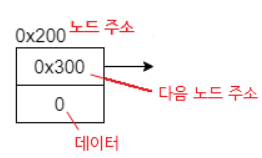
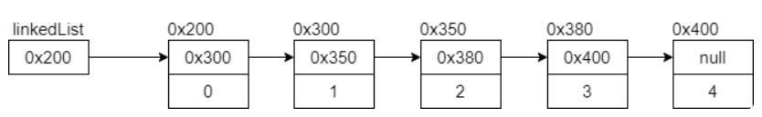
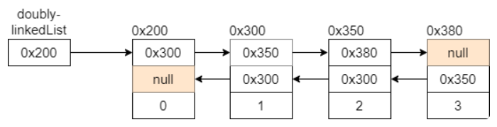
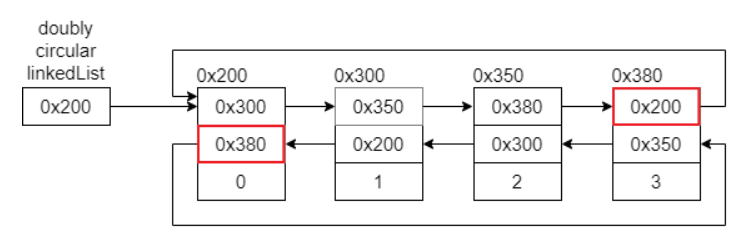
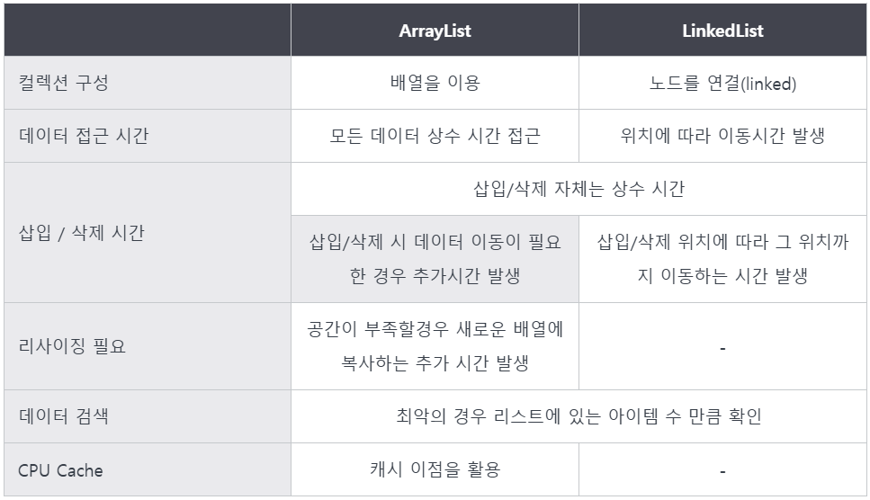

## LinkedList란?

: 데이터를 감싼 노드를 **포인터로 연결**해서 공간적인 효율성을 극대화시킨 자료 구조

- 삽입 / 삭제 : O(1)
- 탐색 : O(n)

### 연결 리스트 종류

- 싱글 연결 리스트 : next 포인터만 존재
    
    
    
- 이중 연결 리스트(양방향 연결 리스트) : next 포인터와 prev 포인터가 존재
    
    
    
- 원형 이중 연결 리스트(양방향 원형 연결 리스트) : 이중 연결 리스트와 똑같지만 마지막 노드의 next 포인터가 헤드 노드를 가리킨다.
    
    
    

## ArrayList와 LinkedList

### ArrayList와 LinkedList 차이점

- 데이터 접근 시간
    - ArrayList : 임의 접근, O(1)
    - LinkedList : **순차 접근**, O(n)
- 데이터 삽입/삭제
    - ArrayList : 기존의 데이터들을 이동시키는 시간이 추가로 발생한다.
        
        → O(n)
        
    - LinkedList : 삽입/삭제 위치에 따라 그 위치까지 이동하는 시간이 발생한다.
        
        → search time + O(1)
        

### ArrayList와 LinkedList 성능 테스트

- **조회** : **ArrayList** > LinkedList
- **삽입 / 삭제** : **LinkedList** > ArrayList

### ArrayList와 LinkedList가 사용되는 곳

삽입, 삭제가 빈번하면 LinkedList, 데이터 조회가 빈번하면 ArrayList를 사용한다.