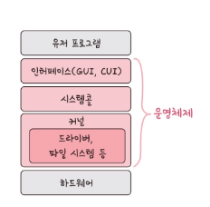

# OS_01 : OS란 무엇이며, 핵심 기능은?

---
컴퓨터 시스템에서 사용자가 편리하게 이용할 수 있도록 하드웨어적 자원과 소프트웨어적 자원을 관리하는 소프트웨어

## OS 구조
1. 인터페이스 - 사용자는 커널에 직접 접근하지 않고, 운영체제가 제공하는 인터페이스를 사용해 커널에 명령
2. 시스템 콜 -  커널이 자신을 보호하기 위해 만든 인터페이스 .
- 커널은 시스템 콜이라는 시스템 자원 사용과 관련된 함수를 제공하고, 운영체제가 제공하는 서비스를 이용하기 위해, 시스템콜을 호출 
3.  커널 - 컴퓨터에 속하는 모든 자원을 관리하는 핵심적인 기능
- 드라이버 - 커널과 하드웨어 장치 간의 통신을 가능하게 하는 소프트웨어
---

## 운영체제 핵심 기능

#### 자원 관리 
여러 응용 프로그램이 자원을 요청하면 적절한 순서로 배분하고 회수하여 자원을 효율적으로 관리한다.

#### 자원 보호
CPU, 메모리 등에 대한 사용자와 응용 프로그램의 직접 접근을 막는다.

#### 인터페이스 제공
하드웨어 인터페이스와 사용자 인터페이스 제공하여 편리하게 사용하도록 지원한다
