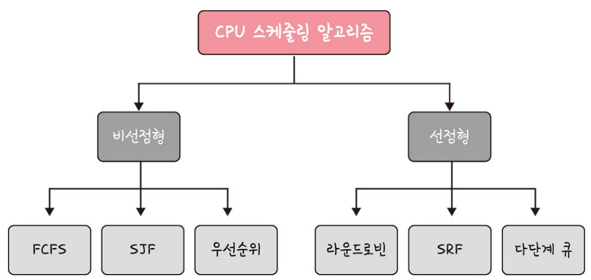
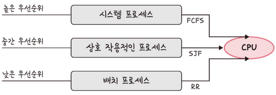

## CPU 스케줄링 알고리즘

: CPU 스케쥴러는 CPU 스케줄링 알고리즘에 따라 **프로세스에서 해야 하는 일을 스레드 단위로 CPU에 할당**한다.

→ 프로그램이 실행될 때 CPU 스케줄링 알고리즘이 **어떤 프로그램에 CPU 소유권을 줄 것인지를 결정**한다.

### CPU 스케줄링 알고리즘의 목적

: CPU 이용률은 높게, 주어진 시간에 많은 일을 하게, 준비 큐(ready queue)에 있는 프로세스는 적게, 응답 시간은 짧게 설정하는 것을 목표로 한다.

- 공평성 : 모든 프로세스가 자원을 공평하게 배정받아야 하며, 특정 프로세스가 배제되어서는 안 된다.
- 효율성 : 시스템 자원이 노는 시간 없이 스케줄링해야 한다.
- 안정성 : 우선순위를 사용하여 중요한 프로세스가 먼저 처리되도록 해야 한다.
- 반응 시간 보장 : 응답이 없는 경우 사용자는 시스템이 멈춘 것으로 가정하기 때문에 시스템은 적절한 시간 안에 프로세스의 요구에 반응해야 한다.
- 무한 연기 방지 : 특정 프로세스의 작업이 무한히 연기되어서는 안 된다.

---

## 비선점형 방식

: **프로세스가 스스로 CPU 소유권을 포기**하는 방식으로 강제로 프로세스를 중지하지 않는다.

→ 컨텍스트 스위칭으로 인한 **부하가 적지만** 프로세스 배치에 따라 **효율성 차이**가 존재한다.

→ 프로세스가 스스로 CPU를 놓아주는, **작업이 완료되는 시점에만 사용**된다.

- **FCFS** (First Come, First Served) : 가장 먼저 온 것을 가장 먼저 처리하는 알고리즘
    
    → 길게 수행되는 프로세스에 의한 convoy effect이 발생할 수 있다.

    > 💡 convey effect : 준비 큐에서 오래 기다리는 현상

    
- **SJF** (Shortest Job First) : 실행 시간이 가장 짧은 프로세스를 가장 먼저 실행하는 알고리즘
    
    → starvation이 발생하며 평균 대기 시간이 가장 짧다.
    
    → 실제로는 실행 시간을 알 수 없기 때문에 과거 실행했던 시간을 토대로 추측해서 사용한다.
    
    
    
    > 💡 starvation : 긴 시간을 가진 프로세스가 실행되지 않는 현상

    
- **우선순위** : 기존의 SJF의 단점을 해결하기 위해 aging 방법을 사용하였다.
    
    → 선점, 비선점방식으로 나뉘며 차이점은 도착한 프로세스의 우선순위가 더 높다면 기존 프로세스를 강제로 중지시키는지의 여부이다.
    
    
    
    > 💡 aging : 우선순위를 높이는 방법

    

## 선점형 방식

: 현대 운영체제가 사용하는 방식으로 지금 사용하고 있는 프로세스를 **알고리즘이 중단시켜 버리고 강제로 다른 프로세스에 CPU 소유권을 할당**하는 방식

→ 선점이 일어날 경우, **오버헤드가 발생**하며 처리시간을 예측하기 어려워진다.

→ **I/O요청, I/O응답, Interrupt발생, 작업완료 등의 상황**에서 사용된다.

- **라운드 로빈** (Round Robin) : 각 프로세스마다 동일한 할당 시간을 주고 그 시간안에 끝내지 못하면 다시 준비 큐로 보내는 알고리즘
    
    → **할당시간이 너무 크면 선입선출**과 다를바가 없어지고 **너무 작으면 오버헤드가 많이 발생**한다.
    
    
    

- **SRTF** (Shortest Remaining Time First) : SJF와 유사하나 실행 도중 실행 시간이 **더 짧은 작업이 들어오면 수행하던 프로세스를 중지**하고 해당 프로세스를 수행하는 알고리즘
    
    → **평균 대기 시간이 가장 짧은** 알고리즘이지만 잦은 Context Switching으로 **오버헤드가 많이 발생하며 starvation이 잦다는 단점**과 CPU 예상 시간을 예측하기 힘들기 때문에 실제로 사용되기 어렵다.
    
    
    

- **다단계 큐** : **우선순위에 따른 준비 큐를 여러 개** 사용하고, 큐마다 라운드 로빈이나 FCFS 등 다른 스케줄링 알고리즘을 적용한 것
    
    → 큐 간의 프로세스 이동이 안되어 **스케줄링 부담이 적지만** **유연성이 떨어지며 starvation과 공평성이 떨어진다는 단점**이 있다.
    
    → 이를 보완하여 우선순위를 변동할 수 있는 다단계 피드백 큐 스케줄링이 있다.
    
    